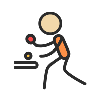
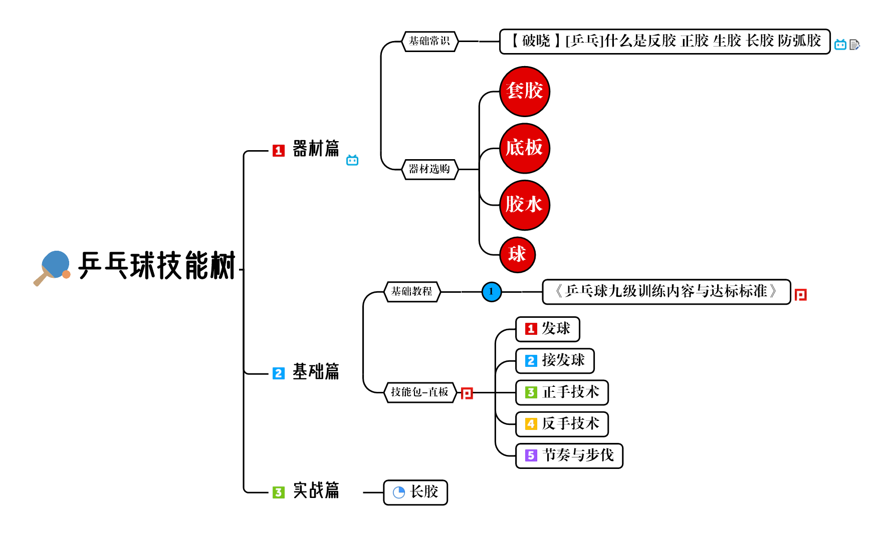
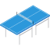

<h1 align="center">

𝐓𝐚𝐛𝐥𝐞𝐓𝐞𝐧𝐧𝐢𝐬 𝟏𝟎𝟏

</h1>

<i><b>Ping Pong !</b></i>

 
 

## Toc
- [SkillMap](#skillmap)
- [Projects & Roadmap](#projects--roadmap)
- [Discussions](#discussions)
- [Statistic](#statistic)
- [Contributors](#contributors)
- [License](#license)
## SkillMap

<b>Online Edition | Download </b>

## Projects & Roadmap

 

<table border="0" align='center'>
<tr>

<td>
<b>A</b>
</td>
<td>
<b>B</b>
</td>
<td>
<b>C</b>
</td>
<td>
<b>D</b>
</td>
</table>

## 💬Discussions 

## Statistic

## Contributors

## License

